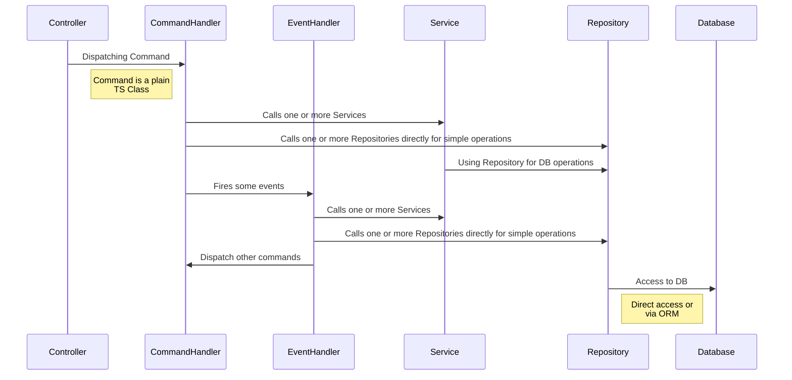

```mermaid
sequenceDiagram
   participant Controller
   participant CommandHandler
   participant EventHandler
   participant Service
   participant Repository
   participant Database
   Controller ->>CommandHandler: Dispatching Command
   Note left of CommandHandler: Command is a plain <br />TS Class
   CommandHandler->>Service: Calls one or more Services
   CommandHandler->>Repository: Calls one or more Repositories directly for simple operations
   Service->>Repository: Using Repository for DB operations
   CommandHandler ->> EventHandler: Fires some events
   EventHandler ->> Service: Calls one or more Services
   EventHandler ->> Repository: Calls one or more Repositories directly for simple operations
   EventHandler ->> CommandHandler: Dispatch other commands
   Repository ->> Database: Access to DB
   Note right of Repository: Direct access or <br /> via ORM
```
